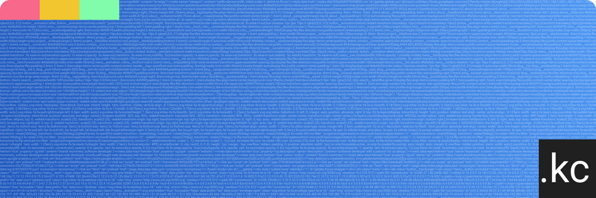

<!--  -->

### 👨🏾‍💻 Krishnan Chettiar (_KC_)

Hi 👋, I'm KC, and I'm learning the ways of UI Design andn Frontend Web Development. I'm based out of Oxford in the 🇬🇧.

Currently I'm dabbling with vanilla Javascript. I also build scale-model planes.

*As for the really important stuff in life - I'm a dad!*
Oh and P.S. I also like these ⚽️ 🏈 🏉 🏏 🏎

---

### ℹ️ Github Stats

---

### 💻 Languages and Tools I use

   
  

### Frameworks I will be learning

 

---

### When I'm not coding, you can find me

- ✈️ building scale aircraft models.
- 📸 enjoying photography.
- ☕️ drinking tea and eating cake.

---

### You can find me on here

 

---
